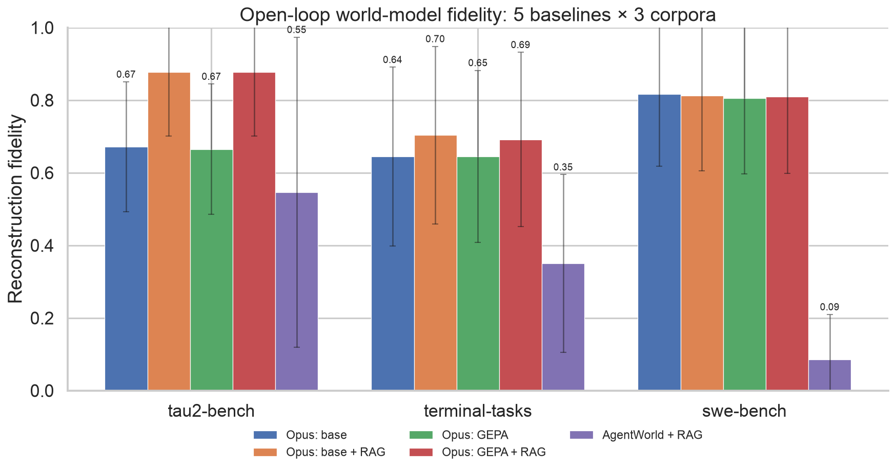

# World Model Harness

> **Docker as an LLM.** Stop running your evals in sandboxes — simulate your environment without running it.

A frontier LLM (Opus 4.8 / GPT 5.5) acts as the *environment* your agent steps against,
reconstructed from your own OpenTelemetry traces. No sandbox, no live services, no flaky resets.

Inspired by **Qwen-AgentWorld** (LLM-as-environment), **GEPA** (reflective prompt evolution), and
**DreamGym** (retrieval over a trace replay buffer) — but with **zero training**: we get there with
prompt optimization on a frontier model. See [`docs/ARCHITECTURE.md`](./docs/ARCHITECTURE.md) for how
the pieces fit (and where to plug in a new provider, adapter, or embedder).

## How it works

1. **Build** from your agent's OTel traces (file export or vendor SDK): ingest → normalize → split
   train/held-out → index a replay buffer → evolve the env prompt with GEPA against the held-out split.
2. **Serve**: agents call `WorldModel.step(action)` (in-process or via the local HTTP backend). Each
   step retrieves the most similar past `(state, action) → observation` examples and predicts the
   next observation.

## Quickstart

```bash
uv sync
wmh providers verify                       # confirm Anthropic / Bedrock / Azure OpenAI / OpenAI creds
wmh build                                  # guided creation wizard (prompts for name, traces, provider…)
wmh build --name airline --file traces.jsonl   # …or fully scriptable with flags -> .wmh/models/airline/
wmh list                                   # show every built world model
wmh eval traces.jsonl                      # score reconstruction fidelity (replay + LLM judge)
wmh bench run tau-bench                     # score a prompt against a committed benchmark (mean ± std)
wmh bench                                   # leaderboard across all persisted benchmark runs
wmh serve                                  # local backend on :8000 (serves all built models)
wmh demo                                   # watch an LLM agent step against the world model
wmh play                                   # step into the environment yourself (interactive REPL)
```

`wmh build` with no flags launches a **creation wizard** on an interactive terminal; pass `--file`
(and friends) or `--no-interactive` to stay scriptable. Commands that run a model (`play`/`serve`/
`demo`) take `--name`; omit it and — if several models exist — you get an interactive **picker**.

World models are **named** and stored under `.wmh/models/<name>/`, so one project can hold several
(e.g. `airline`, `retail`). Commands that read a model take `--name`; if only one is built, `--name`
is optional.

## Use it as an API

```python
from wmh import WorldModel, Action, ActionKind
from wmh.config.store import WorldModelStore
from wmh.engine.loader import load_world_model

# Resolve a named model under the project root (.wmh/models/<name>/) and load it with the
# serve provider + embedder it was built with — no need to reconstruct the provider yourself.
model_dir = WorldModelStore(".wmh").resolve("airline")
wm, _provider = load_world_model(model_dir)

session = wm.new_session(task="check out the cart")
obs = wm.step(session.id, Action(kind=ActionKind.TOOL_CALL, name="add_to_cart",
                                 arguments={"sku": "A1"}))
print(obs.content)
```

Or over HTTP (same code path), namespaced by model name: `GET /world_models` to list, then
`POST /world_models/{name}/sessions` and `POST /world_models/{name}/sessions/{id}/step`.

## Providers

One interface, four backends, verified on startup. Credentials are read from the environment:

| Provider | Model | Env vars |
|---|---|---|
| Anthropic | Opus 4.8 | `ANTHROPIC_API_KEY` |
| AWS Bedrock | Claude 4.8 | `AWS_REGION`, `AWS_ACCESS_KEY_ID`, `AWS_SECRET_ACCESS_KEY` |
| Azure OpenAI | GPT 5.5 | `AZURE_OPENAI_API_KEY`, `AZURE_OPENAI_ENDPOINT` |
| OpenAI | GPT 5.5 | `OPENAI_API_KEY` |

## Benchmark results

**Open-loop reconstruction fidelity** — how faithfully the world model reproduces the *real*
recorded observation for each held-out `(state, action)`, scored 0–1 by a reference-grounded
5-dimension LLM judge (format / factuality / consistency / realism / quality) with a
deterministic-vs-volatile content split. Run with `wmh eval` (teacher-forced replay; the model never
sees the observation it's scored against). Judge: Bedrock **Opus 4.8** for every row (so the numbers
are comparable). Top-k=5 retrieval, 70/30 split, seed 0, all held-out turns scored.

We sweep **five baselines across three real-benchmark corpora** (tau2-bench, terminal-tasks,
swe-bench — captured from the upstream benchmarks). Baselines 1–4 are Opus 4.8 prompted as the
environment; #5 is **Qwen-AgentWorld-35B-A3B**, a *trained* world model served on an H100, scored by
the same judge.



| Baseline | tau2-bench | terminal-tasks | swe-bench |
|---|---|---|---|
| Opus: base | 0.672 ± 0.179 | 0.645 ± 0.246 | 0.817 ± 0.199 |
| Opus: base + RAG | 0.877 ± 0.176 | 0.704 ± 0.244 | 0.813 ± 0.208 |
| Opus: GEPA | 0.665 ± 0.180 | 0.645 ± 0.237 | 0.805 ± 0.208 |
| **Opus: GEPA + RAG** | 0.877 ± 0.176 | 0.692 ± 0.240 | 0.809 ± 0.211 |
| **AgentWorld + RAG** | 0.546 ± 0.427 | 0.350 ± 0.245 | 0.085 ± 0.124 |

_Held-out steps: tau2-bench 84, terminal-tasks 48, swe-bench 52. Full per-step reports under
`benchmarks/results/grid-*.json`._

**What the grid shows:**

1. **Retrieval (RAG) is the dominant lever — and it's corpus-dependent.** On tau2-bench, RAG lifts
   fidelity **+0.205** (0.67 → 0.88): the structured API responses benefit enormously from retrieving
   an analogous response's schema. On terminal-tasks it's a modest +0.06, and on swe-bench ~0 — the
   base prompt already reproduces shell/patch output at 0.81 without examples.

2. **GEPA gives ≈0 lift over the *current* base — by design, not failure.** We re-ran GEPA
   optimization on the improved base for all three corpora; for tau2-bench and swe-bench the evolved
   prompt came back **byte-identical to the base** (GEPA explored 50+ rollouts and kept the seed).
   The reason: the base prompt was hand-tuned to encode the one rule GEPA had previously discovered
   (a lookup of a record that exists returns the populated record, not "not found"). Once that rule
   is in the base, there is nothing left to specialize. **GEPA's historical "+0.11" was real against
   the *old* base — it was absorbed into the base prompt, which is the outcome we wanted.** GEPA
   remains the mechanism for specializing *from* a good starting point; it just has no gap to close
   on these corpora today.

3. **A frontier model prompted as the environment beats a purpose-trained 35B world model, by a
   wide margin.** Qwen-AgentWorld-35B-A3B (a *trained* world model) trails Opus on every corpus:
   0.55 vs 0.88 on tau2, 0.35 vs 0.70 on terminal, 0.09 vs 0.81 on swe-bench. Two failure modes,
   read off the per-step reports: it **breaks character** (on swe-bench it emits agent-style
   `THOUGHT: I need to…` reasoning instead of the file contents the environment should return), and
   it **under-predicts** (returns an empty observation where the real environment produced output or
   an error — 41/84 empty on tau2, 38/48 on terminal). Its huge tau2 variance (±0.43) is bimodal:
   when RAG surfaces a matching record it reproduces it *perfectly* (1.00), otherwise it returns
   nothing. So a 35B model can be a high-fidelity world model for structured lookups, but is far
   less robust than a frontier model across surfaces. _(Judge is Opus 4.8 for this row too, so the
   gap is the world model, not the scorer.)_

4. **The factuality ceiling persists** for the Opus rows (the dominant error mode there): the model
   reproduces response *shape* and success/error status near-perfectly, but cannot know concrete
   values the environment alone holds (exact prices, ids, flights). The largest lever here is
   **state grounding** — see the design note below.

> Numbers are one seed on small held-out splits (per-step std ±0.18–0.43) — directional, not a
> leaderboard. Retrieval uses the offline lexical embedder (semantic untested). AgentWorld ran on a
> local vLLM server (`max-num-seqs` batched, `max_tokens=4096`); a reasoning world model needs a
> large token budget or its think-trace truncates the observation to empty.
> **Reproduce them** (exact commands + the 5-baseline grid runner): [`docs/benchmark_results.md`](./docs/benchmark_results.md).

### Design note: the world model's internal database

Today's open-loop benchmark scores the model with an **empty `state_before`** — the trace-capture
pipeline omits the environment's database to avoid leaking answers — so factuality on
records/computed values has a hard ceiling the model can't beat from `(action, retrieved demos)`
alone. This is a measurement/seeding gap, not a fundamental limit: `EnvState` already carries
`structured` (a state dict) and `scratchpad` (the env's free-text memory, which `WorldModel.step`
updates from each prediction's `state_note`). The direction is to **seed a world model with its
benchmark's initial database** and let it **read/write its own state and memories** as a session
advances — turning factuality from "guess the hidden value" into "look it up in the state you have".

## Development

Managed with [uv](https://docs.astral.sh/uv/); linting/formatting with
[ruff](https://docs.astral.sh/ruff/); type checking with [ty](https://github.com/astral-sh/ty).

```bash
uv sync --extra dev      # create the env + install dev tools
uv run ruff check .      # lint
uv run ruff format .     # format
uv run ty check          # type check
uv run pytest -q         # tests
```

Conventions live in [AGENTS.md](./AGENTS.md). Tests are inline next to the code they cover
(`foo.py` → `foo_test.py`), organized by domain subpackage under `wmh/`.

## Status

The full pipeline works end-to-end: ingest → split → index → GEPA optimize → persist → serve/step,
verified on real Bedrock Opus 4.8 (see [`docs/tau2_runbook.md`](./docs/tau2_runbook.md)). Vendor SDK
pulls are the main stub remaining.
