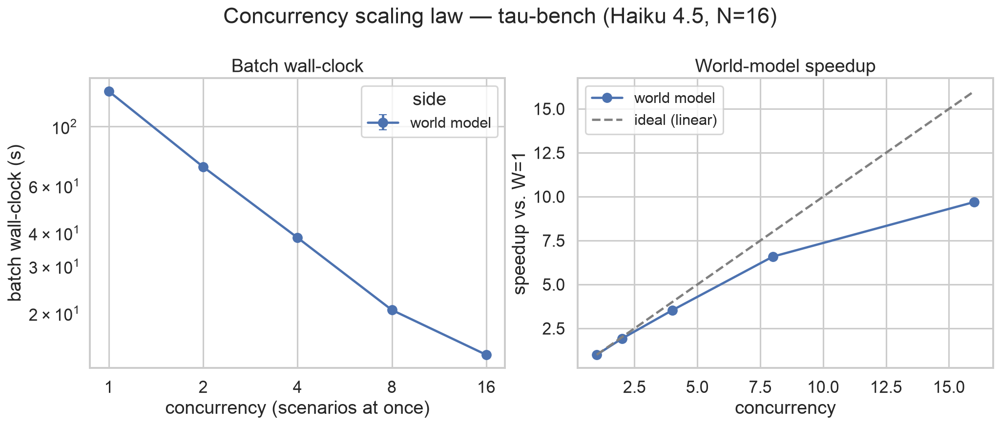

# Concurrency scaling law

**Question:** when we reconstruct a batch of scenarios at once, how does the batch wall-clock fall as
we raise concurrency W — and how does the world model's curve compare to standing up the real
sandboxes at the same concurrency? The x-axis is the number of scenarios running concurrently; the
y-axis is batch wall-clock. With both sides measured we also get the **time differential**
T_real(W) / T_world(W): the world model's standup-free advantage at each level.

This sits in the research surface (`wmh.research`, see [`gepa_research.md`](./gepa_research.md))
alongside the [trace scaling law](./trace_scaling.md), but it is a **systems** experiment, not an
optimization ablation — it reports a wall-clock curve, not a fidelity-vs-knob one. It reuses the
deployed concurrency primitive shipped in `wmh bench side-by-side` (the `--scenarios` / `--concurrency`
fan-out over a `ThreadPoolExecutor`), so the numbers reflect what the harness actually does.

## Why the world model parallelizes cleanly

Open-loop replay is **embarrassingly parallel**: each scenario is teacher-forced from its own
recorded state, so scenarios share nothing. Each one gets its own provider client and its own
`RunTracker` inside `run_scenario`, so concurrent batches never race on metering — the same safety
the merged side-by-side path relies on. The only ceiling is the provider's request concurrency /
rate limit and thread overhead, which is exactly what the efficiency curve exposes.

The real sandbox side is the opposite: each scenario boots a container/process, so concurrency is
bounded by host resources (CPU, disk, the Docker daemon). That asymmetry is the point — it is what
the differential measures.

## Design (`wmh/research/concurrency_scaling.py`)

`run_concurrency_scaling(world_runner, real_runner, *, levels, scenarios, trials, side)` sweeps the
concurrency `levels` (e.g. `1,2,4,8`), running a **fixed batch of N scenarios** at each level
`trials` times, and aggregates each level into a `ConcurrencyPoint`:

- `world_wall_mean ± std`, `real_wall_mean ± std` — batch wall-clock per side (mean ± std across
  trials, reusing `ablation._mean_std` so error bars match the rest of the harness).
- `speedup` = T_world(1) / T_world(W) — measured against the **first** level (put the baseline,
  usually 1, first in `--concurrency-levels`).
- `efficiency` = speedup / W — 1.0 is perfect scaling; the drop-off is contention.
- `differential` = T_real(W) / T_world(W) — >1 means the real sandbox is slower (the WM advantage).

The driver is runner-injected: the caller passes a `world_runner(level) -> WorldBatch` and an
optional `real_runner(level) -> RealBatch` that own the actual `ThreadPoolExecutor`. The runner
script wires them to `run_scenario` and `run_real_sandbox`; the unit tests pass fakes, so the driver
is tested with no network or Docker.

`--side` selects which halves to time: `both` (the differential, default), `world` (cheap; no
sandbox setup — the clean speedup curve), or `real`.

## Running it

`scripts/run_concurrency_scaling.py` is the live runner. It loads the benchmark's bundled world model
(prompt + serve provider + offline embedder), picks the N simplest held-out scenarios, builds the
leak-free demo index **once** (shared read-only across workers, so index-build time never pollutes
the measurement), and sweeps.

```bash
# world-model side only — no tau2 venv needed; the cleanest speedup curve
AWS_REGION=us-east-1 uv run python scripts/run_concurrency_scaling.py tau-bench \
    --scenarios 16 --concurrency-levels 1,2,4,8,16 --side world --out conc_world.json

# both sides — needs tools/tau2-capture venv + TAU2_DATA_DIR; gives the differential
AWS_REGION=us-east-1 uv run python scripts/run_concurrency_scaling.py tau-bench \
    --scenarios 16 --concurrency-levels 1,2,4,8,16 --side both --out conc_both.json
```

The default sweep is `1,2,4,8,16`. Use `--serve-model` to swap the LLM (e.g. Haiku for a cheaper
sweep), `--trials` for error bars, and `--real-arg` to forward flags to the real runner.

### Plotting

`scripts/plot_concurrency_scaling.py` renders a report with seaborn (needs the `viz` extra):

```bash
uv run --extra viz python scripts/plot_concurrency_scaling.py conc_world.json --out conc.png
```

It draws batch wall-clock vs. concurrency (log-log, mean±std error bars), the world-model speedup vs.
ideal-linear, and — when the report has both sides — the time differential T_real/T_world. Pass
several report JSONs to overlay them (e.g. tau-bench vs. swe-bench).

### Measured (tau-bench, Haiku 4.5, N=16, `--side world`)

| W | batch wall | speedup | efficiency |
|---|-----------|---------|-----------|
| 1 | 135.5s | 1.00× | 100% |
| 2 | 70.6s | 1.92× | 96% |
| 4 | 38.3s | 3.53× | 88% |
| 8 | 20.6s | 6.59× | 82% |
| 16 | 14.0s | **9.70×** | 61% |



Wall-clock falls ~10× from W=1 to W=16; the speedup curve tracks ideal-linear early (96% efficiency
at W=2) then bends away as provider/network contention grows (61% at W=16). Fidelity stays 100% and
cost is flat across levels — concurrency buys latency, not accuracy or money.

## The tau-bench caveat (and why swe-bench is the punchline)

tau-bench's "real environment" is cheap — an in-process Python tool layer over a JSON DB, no
container. So at low W the real sandbox can be *faster* than the world model per scenario, and the
differential may favor the sandbox. That is honest: the world model's win is **standup**, and
tau-bench barely has any. The differential flips hard on **swe-bench**, where every real scenario
pulls/builds a multi-GB image — run the same sweep with `swe-bench` to see it.

## Extensibility

tau-bench today; **terminal-tasks and swe-bench are just a different benchmark name** — their corpora
are committed under `examples/` and their real runners are registered in
`wmh/bench/side_by_side.py` (`_RUNNERS`). The experiment takes a benchmark name and reuses its bundled
model, nothing tau2-specific. For swe-bench multi-scenario batches the runner forwards `--warm
--cache` automatically (keyed off the runner registry's `concurrent_purges_images`) so concurrent
cold runs don't purge each other's shared images.
